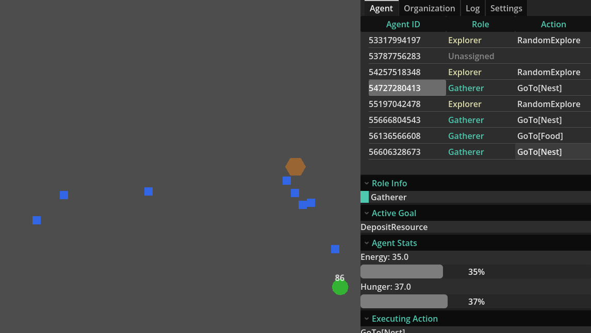

# SMAS — Social Multi-Agent System

A colony-inspired multi-agent simulation built in **Godot 4.7 / GDScript**,
combining **GOAP planning** (Goal-Oriented Action Planning) per agent with
**dynamic, need-based organizational role allocation** across the colony. It
is the research platform behind a study comparing need-based role
distribution against a static, resource-blind split.



Agents spawn with no role, discover resources, report them to a shared
blackboard, and take on roles (Gatherer, Explorer, Guard) as the colony's
needs change — all while managing their own hunger and energy. No agent is
ever *assigned* a role: the organization posts anonymous role requests, and
agents volunteer.

## How it works

**Organization layer.** A single `OrganizationManager` evaluates a
*Threshold Policy* every second: per-role distribution rules (JSON) are
matched against the Nest's resource storage (with a per-capita "low" floor)
and against whether each resource is *known* to the colony's blackboard. It
computes a target distribution, then posts only the **deficit** as anonymous
role requests — and withdraws only excess *requests*, never demoting agents.
A persistently non-empty request queue is a diagnostic signal of
under-population, not a bug.

**Agent layer.** Each agent is a thin composition root over modules:
navigation (`NavigationServer2D`), role acquisition (cooldown-gated,
Nest-zone-gated, surplus-gated volunteering), and a GOAP stack:

- **World state** — 21 boolean facts rebuilt from scratch at every planning
  tick and action completion (held item, hunger/energy flags, visibility,
  blackboard-derived knowledge, Nest stock).
- **Planner** — forward state-space search with uniform cost (no heuristic),
  duplicate-state and goal-contradiction pruning, max depth 20. Generic
  actions like `GoTo` and `GetResource` are *grounded* at plan time into one
  variant per destination/resource kind, derived automatically from the
  resource registry.
- **Fully reactive replanning** — goals are re-scored every tick (2 s), with
  a *Switch Margin* damping oscillation; finished plans replan immediately;
  every completed action is verified against its declared effects
  (*verify-by-effect*), and failures file depletion reports back at the Nest.
- **Survival loop** — hunger rises unconditionally (death at 100); energy
  drains per action and forces rest at zero via a hysteresis-gated fact.
  Any role can eat from colony stock — specialists survive only if the
  colony's logistics keep the pantry filled.

**Roles are pure data.** Adding a role is a JSON file in `configs/roles/` —
allowed goals/actions, priority modifiers, and distribution rules — with no
engine changes.

## Running it

1. Download [Godot 4.7-stable](https://godotengine.org/download).
2. Open the project (`project.godot`) and run `Main.tscn`, or headless:

   ```bash
   godot --headless --path . res://Main.tscn
   ```

3. In a windowed run, press **F1** to toggle the debugger panel: live agent
   roles, goals, plans, the role-request queue, storage, and the role-change
   log.

No addons or external dependencies; all tuning lives in `configs/*.json`
(population size, planning interval, switch margin, hunger/energy rates,
map bounds, thresholds).

## The experiment: dynamic vs. static allocation

The `experiments/dynamic-vs-static-allocation/` directory contains the full
pipeline for the paper's evaluation — a 90-run sweep over population
{4, 8, 16} × resource respawn time {10 s, 30 s, 90 s} × allocation mode
{dynamic, static} × 5 seeds, 10 simulated minutes per run:

```bash
cd experiments/dynamic-vs-static-allocation
./run_sweep.sh                      # 90 headless runs at fixed 240 fps
python -m venv .venv && .venv/Scripts/pip install -r requirements.txt
.venv/Scripts/python analyze.py     # summary table + plots + qualitative cases
```

Every swept parameter is a CLI override (`--agent-count`, `--respawn-time`,
`--distribution-mode`, `--seed`, `--duration`, `--log-metrics`) parsed after
Godot's `--` separator, so single runs are reproducible exactly. The
*static* baseline replaces only the target distribution (a fixed 50/50
Gatherer/Explorer split, blind to resource state) while keeping the request
queue and eligibility mechanics identical.

Measured metrics: **storage recovery time**, **role churn**
(changes/agent/min), **throughput** (deposits/min), and **transition
latency** (role change → the agent's next verified productive action), plus
automatically extracted qualitative cases (discovery cascades, deaths in
context, replanning-oscillation backstop trips, persistent queue
starvation).

The dataset evaluated in the paper — raw per-run CSVs/event logs and the
derived analysis — is committed under `results/` and `analysis/`, pinned by
tag **`v0.2.7`**.

## Project structure

```
configs/          All role/goal/action/resource/simulation definitions (JSON)
agents/           Agent composition root + modules; agents/planner/ holds the
                  GOAP planner, executor, and action grounding
organization/     OrganizationManager (autoload), Nest, blackboard,
                  explored trail
resources/        Resource nodes and spawn/respawn management
simulation/       Scene wiring, config loading, experiment CLI parsing
ui/debugger/      In-game debugger panel and overlay
experiments/      Sweep runner, metrics logger, offline analysis
tests/            Standalone headless test scenes (PASS/FAIL per assertion)
```

## License

[MIT](LICENSE) © 2026 Arthur Sardella
